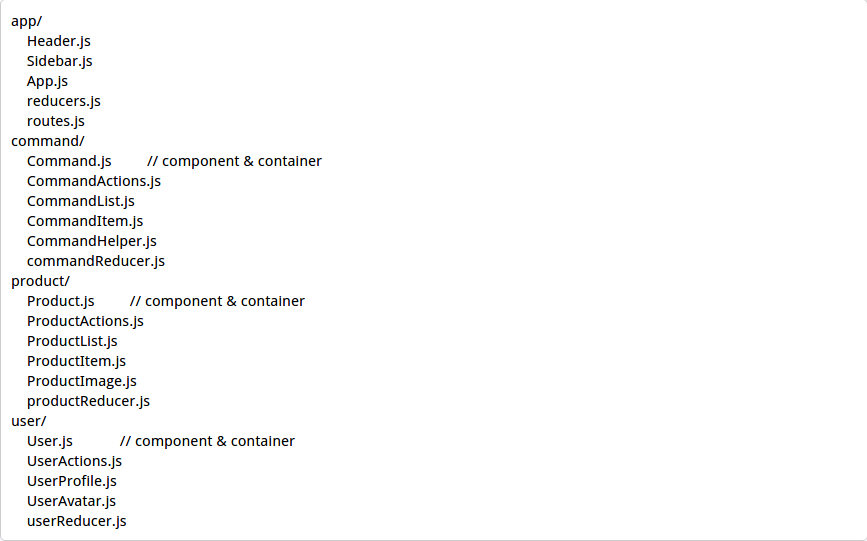

reactjs project
=====================

## 开始

    //安装依赖
    npm install 
    
    //开发环境，演示地址：http://localhost:3000
    npm start 
    
    //生产环境，dist目录
    npm run build 
    
    //js代码规格检测
    npm run eslint

## 框架 / 类库

+ [react](https://github.com/facebook/react)
+ [redux](https://github.com/reactjs/redux)
+ [react-redux](https://github.com/reactjs/react-redux)
+ [react-router](https://github.com/reactjs/react-router)
+ [react-router-redux](https://github.com/reactjs/react-router-redux)
+ [immutable](https://facebook.github.io/immutable-js/)
+ [normalizr](https://github.com/gaearon/normalizr)

## 工具

+ [webpack](https://github.com/webpack/webpack)
+ [webpack-config](https://github.com/mdreizin/webpack-config)（拆分及共享生产环境配置和开发环境配置）
+ [webpack-dev-server](https://github.com/webpack/webpack-dev-server)（开发环境服务器）
+ [babel-loader](https://github.com/babel/babel-loader)（处理 jsx 和 es6）
+ [style-loader](https://github.com/webpack/style-loader)（js require css）
+ [css-loader](https://github.com/webpack/css-loader)（js require css）
+ [sass-loader](https://github.com/jtangelder/sass-loader)（解析scss）
+ [postcss-loader](https://github.com/postcss/postcss-loader)（用于css自动补全浏览器前缀）
+ [extract-text-webpack-plugin](https://github.com/webpack/extract-text-webpack-plugin)（用于打包时分离js和css）

## 目录结构

### [参考1](http://marmelab.com/blog/2015/12/17/react-directory-structure.html) [参考2](https://github.com/erikras/react-redux-universal-hot-example)

1. 按功能逻辑划分，根据功能逻辑在 `javascript` 内创建相应的目录名 ，在该目录内创建相应的 `component / reducer / action` 等
2. 样式文件和1做法一致（以 `styles` 为父目录）

## 配置文件说明

1. webpack.base.config.js，生产和开发环境共用配置
2. webpack.dev.config.js，开发环境配置
3. webpack.prod.config.js，生产环境配置

## 补充说明

1. 开发环境下开启热加载模式，自动变更页面
2. 可以直接 ` import ` node_modules / styles / static 内的文件
3. 第三方库和源码分开打包
4. 使用 [css-modules](https://github.com/css-modules/css-modules)

## 注意

1. 并没有整合livescript， 因为不知道怎么和 jsx / es6 共存